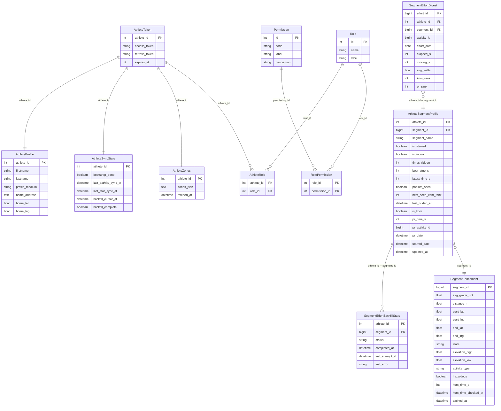

# Data Models

All models use SQLAlchemy 2.x mapped-column syntax. SQLite in dev, PostgreSQL path available via `DATABASE_URL`.

---

## `athlete_tokens` — `AthleteToken` (`models/athlete.py`)

Stores the Strava OAuth token for each connected athlete.

| Column | Type | Notes |
|--------|------|-------|
| `athlete_id` | Integer PK | Strava athlete ID |
| `access_token` | String | Short-lived Strava access token |
| `refresh_token` | String | Long-lived refresh token |
| `expires_at` | Integer | Unix timestamp; refreshed automatically when < 60 s away |

---

## `athlete_profile` — `AthleteProfile` (`models/athlete.py`)

Cached Strava profile data plus per-athlete settings.

| Column | Type | Notes |
|--------|------|-------|
| `athlete_id` | Integer PK | Strava athlete ID |
| `firstname` | String | |
| `lastname` | String | |
| `profile_medium` | String | URL to Strava avatar (medium size) |
| `home_address` | Text | Human-readable address (set via Nominatim geocoding) |
| `home_lat` | Real | Per-athlete home lat override (null = use `HOME_LAT` env var) |
| `home_lng` | Real | Per-athlete home lng override (null = use `HOME_LNG` env var) |

---

## `roles` — `Role` (`models/athlete.py`)

Local app roles used for authorization. Startup seeds `admin`.

| Column | Type | Notes |
|--------|------|-------|
| `id` | Integer PK | Autoincrement |
| `name` | String unique | Stable role key, e.g. `admin` |
| `label` | String | Human-readable label |

---

## `permissions` — `Permission` (`models/athlete.py`)

Local app permissions granted through roles. Startup seeds `backfill_from_ui` and `strava_api_token_visible`, both granted to `admin`.

| Column | Type | Notes |
|--------|------|-------|
| `id` | Integer PK | Autoincrement |
| `code` | String unique | Stable permission key, e.g. `backfill_from_ui`, `strava_api_token_visible` |
| `label` | String | Human-readable label |
| `description` | String? | Optional detail for admin tooling |

---

## `role_permissions` — `RolePermission` (`models/athlete.py`)

Join table granting permissions to roles.

| Column | Type | Notes |
|--------|------|-------|
| `role_id` | Integer PK/FK | References `roles.id` |
| `permission_id` | Integer PK/FK | References `permissions.id` |

---

## `athlete_roles` — `AthleteRole` (`models/athlete.py`)

Join table assigning roles to Strava athletes. Startup grants `admin` to the only connected athlete when no role assignments exist.

| Column | Type | Notes |
|--------|------|-------|
| `athlete_id` | Integer PK | Strava athlete ID |
| `role_id` | Integer PK/FK | References `roles.id` |

---

## `athlete_sync_state` — `AthleteSyncState` (`models/athlete.py`)

Tracks sync progress for each athlete.

| Column | Type | Notes |
|--------|------|-------|
| `athlete_id` | Integer PK | |
| `bootstrap_done` | Boolean | True after the first `run_sync` completes; guards backfill eligibility |
| `last_activity_sync_at` | DateTime | Updated after each `run_sync`; used as `after` cursor for incremental syncs |
| `last_star_sync_at` | DateTime | Updated after each starred-segment fetch |
| `backfill_cursor_at` | DateTime | Oldest timestamp covered once historical backfill completes |
| `backfill_complete` | Boolean | True once starred-segment historical backfill has finished/skipped all segments; reset on starred sync so newly starred segments can be picked up |

---

## `athlete_zones` — `AthleteZones` (`models/athlete.py`)

Caches the full `GET /athlete/zones` response for each athlete. The KOM/QOM candidates service reads `power.zones` from this payload to tag candidates by estimated difficulty without calling Strava during page load.

| Column | Type | Notes |
|--------|------|-------|
| `athlete_id` | Integer PK | Strava athlete ID |
| `zones_json` | Text | Full zones response payload as JSON |
| `fetched_at` | DateTime | Last successful zones fetch; refreshed after 7 days |

---

## `segment_effort_backfill_state` — `SegmentEffortBackfillState` (`models/segment.py`)

Tracks historical `GET /segment_efforts` progress per starred segment so a rate-limited daily run can resume without re-fetching completed segments.

| Column | Type | Notes |
|--------|------|-------|
| `athlete_id` | Integer PK | |
| `segment_id` | BigInteger PK | |
| `status` | String | `pending`, `done`, or `skipped` |
| `completed_at` | DateTime? | Set when the segment is done or skipped |
| `last_attempt_at` | DateTime? | Last time the segment was attempted |
| `last_error` | String? | Truncated error text for skipped segments |

---

## `segment_effort_digest` — `SegmentEffortDigest` (`models/segment.py`)

One row per segment effort (attempt). This is the raw ledger of all efforts fetched from Strava via detailed activities or direct `GET /segment_efforts` backfill.

| Column | Type | Notes |
|--------|------|-------|
| `effort_id` | BigInteger PK | Strava effort ID |
| `athlete_id` | Integer (idx) | |
| `segment_id` | BigInteger (idx) | |
| `activity_id` | BigInteger | |
| `effort_date` | Date | |
| `elapsed_s` | Integer | Wall-clock time in seconds |
| `moving_s` | Integer? | Moving time (may be null) |
| `avg_watts` | Float? | |
| `kom_rank` | Integer? | Rank at time of effort (null if not ranked) |
| `pr_rank` | Integer? | PR rank at time of effort |

---

## `athlete_segment_profile` — `AthleteSegmentProfile` (`models/segment.py`)

One row per (athlete, segment) pair. Aggregated performance profile, recomputed from `SegmentEffortDigest` after each sync. Athlete-specific fields from `GET /segments/starred` (PR, `is_kom`, `starred_date`) are written here on every starred-segment sync.

| Column | Type | Notes |
|--------|------|-------|
| `athlete_id` | Integer PK | |
| `segment_id` | BigInteger PK | |
| `segment_name` | String | Denormalised for query convenience |
| `is_starred` | Boolean | Whether athlete has starred this segment |
| `is_indoor` | Boolean | True if virtual/indoor (detected at ingest) |
| `times_ridden` | Integer | Total effort count |
| `best_time_s` | Integer? | Best elapsed time across all synced efforts |
| `latest_time_s` | Integer? | Most recent elapsed time |
| `best_avg_watts` | Float? | |
| `latest_avg_watts` | Float? | |
| `top10_seen` | Boolean | Ever ranked ≤ 10 |
| `podium_seen` | Boolean | Ever ranked ≤ 3 |
| `best_seen_kom_rank` | Integer? | Best ever KOM rank observed |
| `last_seen_kom_rank` | Integer? | Most recent KOM rank |
| `last_ridden_at` | DateTime? | |
| `is_kom` | Boolean | Athlete currently holds KOM per starred response (`athlete_pr_effort.is_kom`) |
| `pr_time_s` | Integer? | Strava's authoritative all-time PR (may predate our sync window) |
| `pr_activity_id` | BigInteger? | Activity containing the PR |
| `pr_date` | DateTime? | Date the PR was set |
| `starred_date` | DateTime? | When athlete starred this segment |
| `updated_at` | DateTime | Last recompute timestamp |

---

## `segment_enrichment` — `SegmentEnrichment` (`models/segment.py`)

Segment metadata shared across athletes. Geometry/grade/elevation fields come from `GET /segments/starred` on every sync (no TTL). `kom_time_s` is populated during gap-first onboarding and later backfill from `GET /segments/{id}`; for current KOM/QOM holders it is inferred from starred `athlete_pr_effort.pr_time_s` without a detail call. `gap_to_kom_s` is **not stored** — computed at query time.

| Column | Type | Notes |
|--------|------|-------|
| `segment_id` | BigInteger PK | |
| `segment_name` | String? | |
| `distance_m` | Float? | |
| `avg_grade_pct` | Float? | |
| `max_grade_pct` | Float? | |
| `start_lat` | Float? | Used for home-distance calculation |
| `start_lng` | Float? | |
| `end_lat` | Float? | |
| `end_lng` | Float? | |
| `city` | String? | |
| `country` | String? | |
| `state` | String? | Region/state (e.g. "Rhône-Alpes") |
| `climb_category` | Integer? | 0 = uncategorised, 1–5 = HC |
| `elevation_high` | Float? | Absolute altitude at top of segment (m) |
| `elevation_low` | Float? | Absolute altitude at bottom of segment (m) |
| `activity_type` | String? | `"Ride"`, `"Run"`, `"VirtualRide"` — primary indoor signal |
| `hazardous` | Boolean? | Strava-flagged dangerous segment |
| `kom_time_s` | Integer? | KOM time in seconds; null when `xoms.kom` is unavailable |
| `kom_time_checked_at` | DateTime? | Last `GET /segments/{id}` attempt; lets null KOM times be cached |
| `cached_at` | DateTime | Timestamp of last enrichment write |

---

## Key relationships

`AthleteSegmentProfile` is the primary read model for the KOM/QOM candidates feature. `SegmentEnrichment` provides the grade, distance, and KOM time needed for gap calculation. `AthleteZones` provides cached power zones for difficulty tags. `SegmentEnrichment` rows are shared across athletes; KOM-time checks and athlete zones are refreshed after 7 days.
