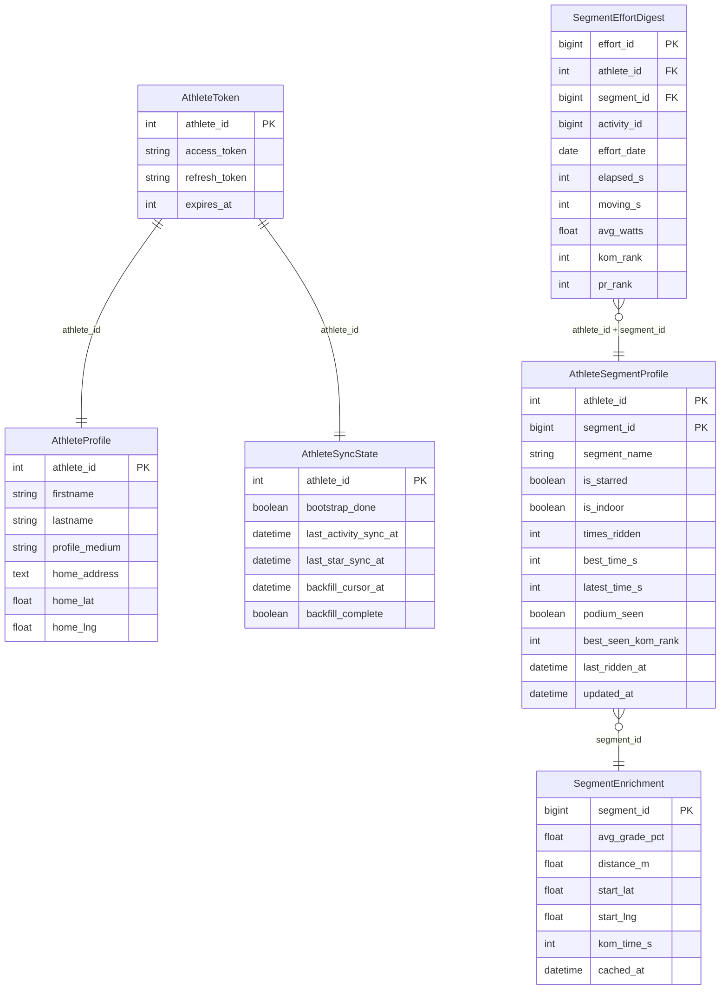

# Data Models

All models use SQLAlchemy 2.x mapped-column syntax. SQLite in dev, PostgreSQL path available via `DATABASE_URL`.

---

## `athlete_tokens` — `AthleteToken` (`models/athlete.py`)

Stores the Strava OAuth token for each connected athlete.

| Column | Type | Notes |
|--------|------|-------|
| `athlete_id` | Integer PK | Strava athlete ID |
| `access_token` | String | Short-lived Strava access token |
| `refresh_token` | String | Long-lived refresh token |
| `expires_at` | Integer | Unix timestamp; refreshed automatically when < 60 s away |

---

## `athlete_profile` — `AthleteProfile` (`models/athlete.py`)

Cached Strava profile data plus per-athlete settings.

| Column | Type | Notes |
|--------|------|-------|
| `athlete_id` | Integer PK | Strava athlete ID |
| `firstname` | String | |
| `lastname` | String | |
| `profile_medium` | String | URL to Strava avatar (medium size) |
| `home_address` | Text | Human-readable address (set via Nominatim geocoding) |
| `home_lat` | Real | Per-athlete home lat override (null = use `HOME_LAT` env var) |
| `home_lng` | Real | Per-athlete home lng override (null = use `HOME_LNG` env var) |

---

## `athlete_sync_state` — `AthleteSyncState` (`models/athlete.py`)

Tracks sync progress for each athlete.

| Column | Type | Notes |
|--------|------|-------|
| `athlete_id` | Integer PK | |
| `bootstrap_done` | Boolean | True after the first `run_sync` completes; guards backfill eligibility |
| `last_activity_sync_at` | DateTime | Updated after each `run_sync`; used as `after` cursor for incremental syncs |
| `last_star_sync_at` | DateTime | Updated after each starred-segment fetch |
| `backfill_cursor_at` | DateTime | How far back the historical backfill has reached |
| `backfill_complete` | Boolean | True once the full history (up to 365 days) has been fetched |

---

## `segment_effort_digest` — `SegmentEffortDigest` (`models/segment.py`)

One row per segment effort (attempt). This is the raw ledger of all efforts fetched from Strava.

| Column | Type | Notes |
|--------|------|-------|
| `effort_id` | BigInteger PK | Strava effort ID |
| `athlete_id` | Integer (idx) | |
| `segment_id` | BigInteger (idx) | |
| `activity_id` | BigInteger | |
| `effort_date` | Date | |
| `elapsed_s` | Integer | Wall-clock time in seconds |
| `moving_s` | Integer? | Moving time (may be null) |
| `avg_watts` | Float? | |
| `kom_rank` | Integer? | Rank at time of effort (null if not ranked) |
| `pr_rank` | Integer? | PR rank at time of effort |

---

## `athlete_segment_profile` — `AthleteSegmentProfile` (`models/segment.py`)

One row per (athlete, segment) pair. Aggregated performance profile, recomputed from `SegmentEffortDigest` after each sync.

| Column | Type | Notes |
|--------|------|-------|
| `athlete_id` | Integer PK | |
| `segment_id` | BigInteger PK | |
| `segment_name` | String | Denormalised for query convenience |
| `is_starred` | Boolean | Whether athlete has starred this segment |
| `is_indoor` | Boolean | True if virtual/indoor (detected at ingest) |
| `times_ridden` | Integer | Total effort count |
| `best_time_s` | Integer? | Best elapsed time |
| `latest_time_s` | Integer? | Most recent elapsed time |
| `best_avg_watts` | Float? | |
| `latest_avg_watts` | Float? | |
| `top10_seen` | Boolean | Ever ranked ≤ 10 |
| `podium_seen` | Boolean | Ever ranked ≤ 3 |
| `best_seen_kom_rank` | Integer? | Best ever KOM rank observed |
| `last_seen_kom_rank` | Integer? | Most recent KOM rank |
| `last_ridden_at` | DateTime? | |
| `updated_at` | DateTime | Last recompute timestamp |

---

## `segment_enrichment` — `SegmentEnrichment` (`models/segment.py`)

Segment metadata fetched from Strava and cached with a 7-day TTL. Avoids re-fetching static segment details.

| Column | Type | Notes |
|--------|------|-------|
| `segment_id` | BigInteger PK | |
| `segment_name` | String? | |
| `distance_m` | Float? | |
| `avg_grade_pct` | Float? | |
| `max_grade_pct` | Float? | |
| `start_lat` | Float? | Used for home-distance calculation |
| `start_lng` | Float? | |
| `city` | String? | |
| `country` | String? | |
| `climb_category` | Integer? | 0 = uncategorised, 1–5 = HC |
| `kom_time_s` | Integer? | Current KOM time in seconds (from `xoms` field) |
| `cached_at` | DateTime | Stale after 7 days → triggers re-fetch |

---

## Key relationships

`AthleteSegmentProfile` is the primary read model for the KOM/QOM candidates feature. `SegmentEnrichment` provides the grade, distance, and KOM time needed for gap calculation. `SegmentEnrichment` rows are shared across athletes and stale after 7 days.
